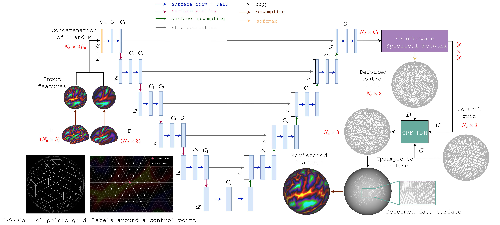

# DDR
DDR: Deep-Discrete spherical Registration

This repository contains the code for performing spherical (cortical) surface registration using deep learning. This is the official PyTorch implementation of the paper [A Deep-Discrete Learning Framework for Spherical Surface Registration](https://arxiv.org/abs/2203.12999), accepted at the MICCAI 2022 conference.  

